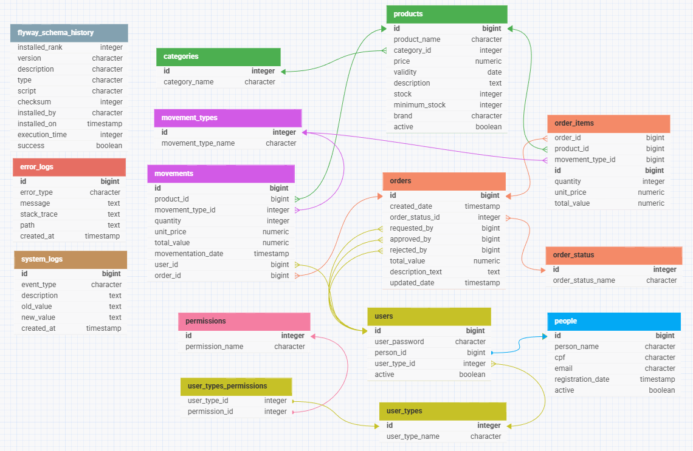

# 🗂️ Diagrama ER — Inventory Notification System

Este documento apresenta o **Diagrama Entidade–Relacionamento (ER)** utilizado no  
**Inventory Notification System Backend**. Ele representa a estrutura do banco de dados  
e os relacionamentos entre as entidades principais do sistema.

---

## 📊 Diagrama completo

  

---

<a href="../README.md">🔄 Voltar para a documentação completa</a>

