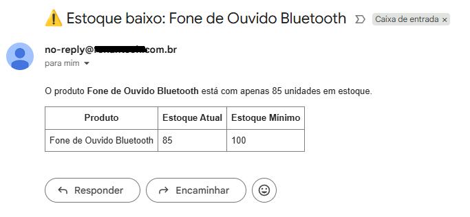

# 📧 Exemplos Reais das Notificações Enviadas pelo Sistema

Esta página apresenta capturas de tela reais dos e-mails enviados pelo  
**Inventory Notification System Backend**, demonstrando o funcionamento  
dos fluxos de alerta e relatórios automáticos.

---

## 🔻 Alerta: Estoque abaixo do mínimo
E-mail enviado automaticamente quando um produto atinge um nível crítico de estoque.

---

## 📊 Relatório Diário de Pedidos
Resumo consolidado de todos os pedidos gerados no dia, enviado automaticamente ao final do dia.

 
<a href="../README.md">🔄 Voltar para a documentação completa</a>
