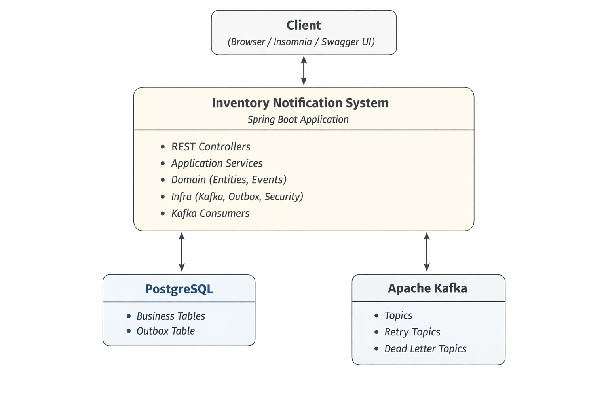
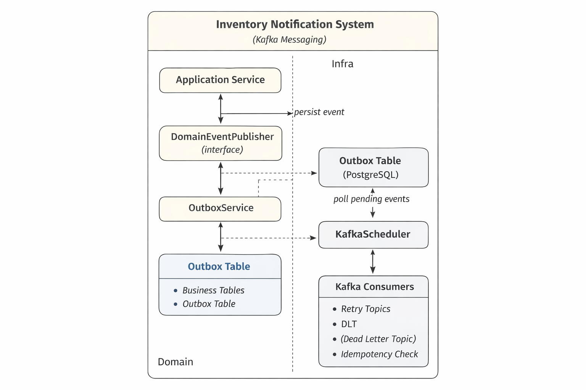

# 📡 Arquitetura de Mensageria com Apache Kafka

---

## Objetivo

Esta documentação descreve a arquitetura de mensageria do sistema Sistema de Notificação de Estoque, projetada para garantir:

- desacoplamento entre contextos de negócio
- confiabilidade no envio de eventos
- tolerância a falhas
- rastreabilidade ponta a ponta
- preparação para crescimento e integrações futuras

A solução foi modelada com base em padrões amplamente utilizados em sistemas distribuídos no mercado.

---

## Visão Geral da Arquitetura

O sistema adota um modelo event-driven, onde ações relevantes do domínio geram eventos de domínio, que são publicados de forma assíncrona via Apache Kafka.

Esses eventos não dependem diretamente do broker, garantindo isolamento do domínio e maior flexibilidade arquitetural.

---

## Diagramas C4

### C4 — Container Diagram

<p align="center">
  
</p>

### C4 — Component Diagram (Mensageria Kafka)

<p align="center">
  
</p>

---

## Contexto Arquitetural

O sistema foi inicialmente concebido como uma aplicação monolítica tradicional.
Com a evolução das regras de negócio, surgiram necessidades como:

- processamento assíncrono
- envio de notificações
- integração futura com sistemas externos
- isolamento entre fluxos críticos

Para atender esses requisitos sem acoplamento direto entre domínios,
foi adotado um modelo de comunicação baseado em eventos utilizando Apache Kafka.

---

## Decisões Arquiteturais

### Por que Kafka?

- alto throughput
- garantia de entrega
- suporte nativo a retry e DLT
- ampla adoção no mercado
- maturidade do ecossistema Spring

### Por que eventos de domínio?

- desacoplamento
- independência da infraestrutura
- maior testabilidade
- alinhamento com Domain-Driven Design

### Por que Outbox Pattern?

- evitar inconsistência entre banco e mensageria
- garantir entrega mesmo em falhas
- padrão amplamente adotado em sistemas distribuídos

---

## Responsabilidades por Camada

### Domain
- definição dos eventos de negócio
- contratos independentes de infraestrutura

### Application
- orquestração dos casos de uso
- disparo de eventos de domínio

### Infra
- implementação Kafka
- producers
- consumers
- retry
- DLT
- outbox

---

## Fluxo simplificado

```plaintext
Controller
   ↓
Service (regra de negócio)
   ↓
DomainEventPublisher
   ↓
Outbox Pattern (banco)
   ↓
Outbox Scheduler
   ↓
Kafka Producer
   ↓
Kafka Topic
   ↓
Consumer
   ↓
Retry → DLT
```

---

## Eventos de Domínio

Eventos representam fatos que já aconteceram no sistema.

Exemplos:
- pedido criado
- estoque abaixo do mínimo

Eles pertencem exclusivamente à camada de domínio e não possuem dependência de Kafka.

Isso garante:
- testabilidade
- isolamento
- liberdade para trocar a infraestrutura futuramente

---

## Event Envelope

Todos os eventos são publicados encapsulados em um envelope padronizado, contendo:

- eventId
- eventType
- version
- correlationId
- source
- payload

### Benefícios

- padronização de comunicação
- versionamento seguro
- rastreabilidade distribuída
- compatibilidade futura entre produtores e consumidores

---

## Versionamento de Eventos

O sistema utiliza versionamento explícito de eventos (`v1`, `v2`, …).

O versionamento permite:
- evolução do contrato sem quebra
- coexistência de versões
- migração gradual de consumidores

### Exemplo:

```plaintext
order-created-v1
order-created-v2
```

---

## Roteamento Centralizado de Tópicos

A definição e resolução de tópicos Kafka é feita de forma centralizada.

Isso evita:
- strings espalhadas no código
- duplicidade
- erros de nomenclatura

E permite alterar o mapeamento de eventos sem impacto direto nos serviços.

---

## Retry e Dead Letter Topic (DLT)

Falhas no consumo são tratadas automaticamente utilizando:
- múltiplas tentativas
- backoff exponencial
- retry topics intermediários
- envio final para DLT

Esse modelo garante:
- resiliência a falhas temporárias
- isolamento de mensagens problemáticas
- continuidade do processamento do sistema

---

## Idempotência no Consumer

O Kafka pode reenviar mensagens em diversos cenários (rebalanceamento, falhas, retry).

Por isso, os consumers implementam idempotência, garantindo que um mesmo evento:
- seja processado apenas uma vez
- não gere efeitos colaterais duplicados

Isso é feito por meio do armazenamento dos eventId já processados.

---

## Correlation ID e Observabilidade

Cada evento possui um correlationId, propagado automaticamente nos logs.

Isso permite:
- rastreamento ponta a ponta
- análise de falhas
- debugging em ambientes distribuídos

---

## Outbox Pattern

Para evitar inconsistência entre banco de dados e mensageria, o sistema utiliza o Outbox Pattern.

### Problema resolvido

Sem outbox:
- dados salvos
- evento não enviado
- sistema inconsistente

Com outbox:
- evento é persistido na mesma transação
- envio ocorre posteriormente
- consistência garantida

Esse padrão é amplamente adotado em arquiteturas distribuídas modernas.

---

## Benefícios da Arquitetura

- domínio desacoplado da infraestrutura
- alta confiabilidade
- tolerância a falhas
- arquitetura evolutiva
- alinhamento com padrões de mercado

---

## Decisões não adotadas

- Não foi adotado CDC (Debezium) por complexidade desnecessária ao cenário atual
- Não foi adotado schema registry neste momento
- Consumers permanecem no mesmo serviço por simplicidade operacional

 <p align="right"><a href="../../README.md">🔄 Voltar para a documentação completa</a></p>
