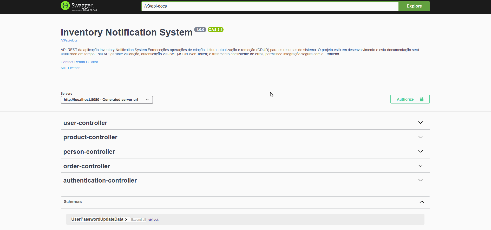

# 🎥 Swagger – Demonstrações Visuais

Este documento apresenta exemplos visuais da interface Swagger utilizada na API Sistema de Notificação de Estoque.

---

## 🔐 Realizar login via API com JWT
Autenticação segura em ação, retornando token JWT.

---

## 📝 Cadastrar pessoa/usuários
Criação integrada de pessoa e usuário com regras específicas de validação.

---

## 📄 Listar pessoas e usuários
Resposta rápida, com paginação e filtros aplicados.

---

## ❌✅ Remover e ativar pessoas
Soft delete e ativação de pessoas, com controle de acesso aplicado.

---

## 🔑 Alterar senha de usuário
Exemplo de alteração de senha via endpoint PUT.

---

## ✏️ Alterar tipo de usuário
Exemplo de alteração de tipo de usuário via endpoint PUT.

---

## ❌✅ Remover e ativar usuários
Soft delete e ativação de usuários, com controle de acesso aplicado.

---

## 📄 Listar produtos
Resposta rápida, com paginação e filtragem personalizada.

---

## 📝 Cadastrar produto
Exemplo de requisição POST para cadastrar um produto via API REST.

---

## ❌✅ Remover e ativar produtos
Soft delete e ativação de produtos, com controle de acesso aplicado.

---

## ✏️ Alterar dados de um produto
Exemplo de alteração de dados de um produto via endpoint PUT.

---

## 📄 Listar pedidos
Resposta rápida, com paginação e filtragem personalizada.

---

## 📝 Cadastrar pedido
Exemplo de requisição POST para cadastrar um pedido via API REST.

---

## ✏️ Alterar dados de um pedido pendente
Exemplo de alteração de dados de um pedido via endpoint PUT.

---

## ✅ Aprovar pedido
Controle de acesso aplicado em endpoints de atualização de status.

---

## ❌ Reprovar pedido
Controle de acesso aplicado em endpoints de atualização de status.

---

## 📚 Visualizar documentação completa
Navegação geral pelo Swagger UI, destacando endpoints e descrições.

 
<a href="../README.md">🔄 Voltar para a documentação completa</a>
